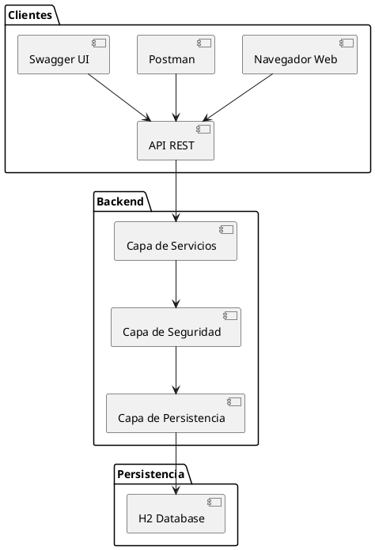
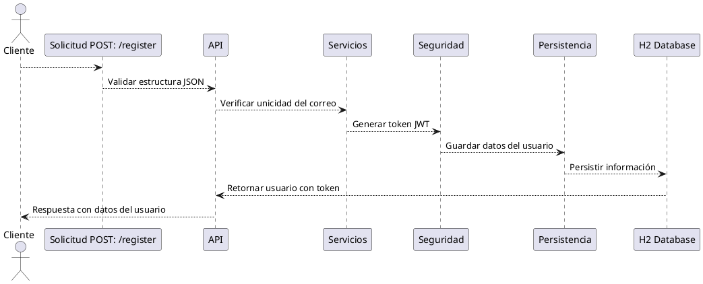

# Arquitectura del Proyecto: API de Gestión de Usuarios

## Diagrama de Arquitectura
El sistema se organiza en capas modulares para garantizar escalabilidad y claridad:

## Diagrama de Solución de Arquitectura

## Requisitos Técnicos

- **Java 17**: Lenguaje principal.
- **Spring Boot**: Framework para construir la API REST.
- **H2 Database**: Base de datos en memoria para persistencia.
- **JWT**: Para autenticación basada en tokens.
- **Swagger**: Para documentación y pruebas de API.
- **Gradle**: Herramienta de construcción del proyecto.

---

Este diseño asegura modularidad, seguridad y claridad, con un flujo bien definido entre cada capa del sistema.
